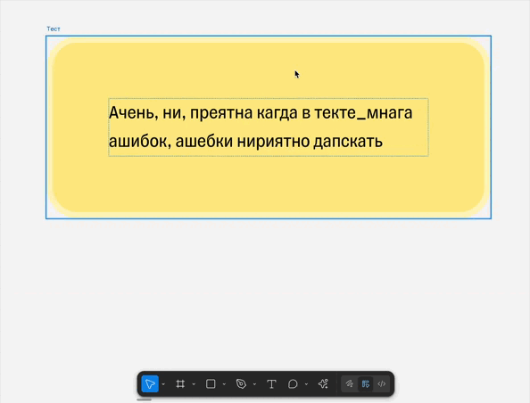

## Установка и запуск

1. Склонируйте репозиторий.
2. Скачайте, запустите сервер и через манифест добавить в фигму, готово.
3. Ключ Mistral можно использовать мой, но лучше получить такой же бесплатный.

### Демо

